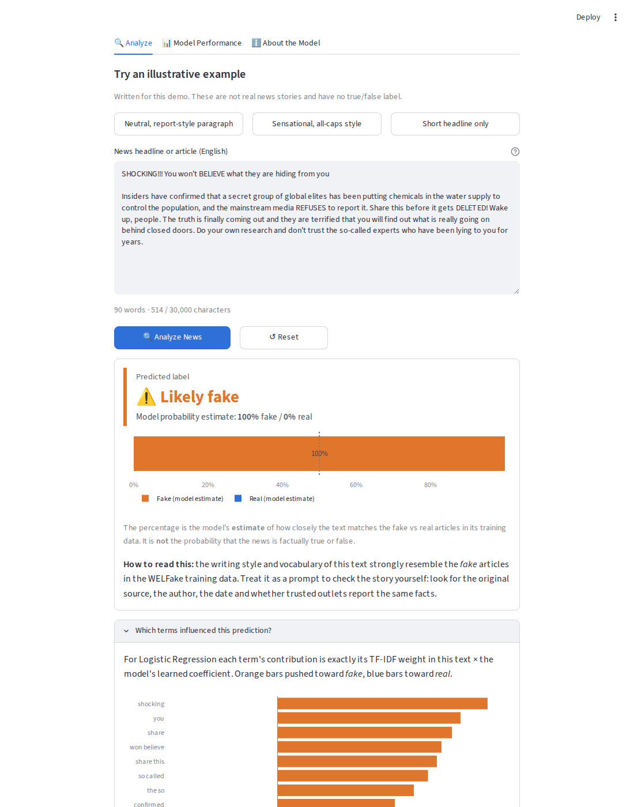
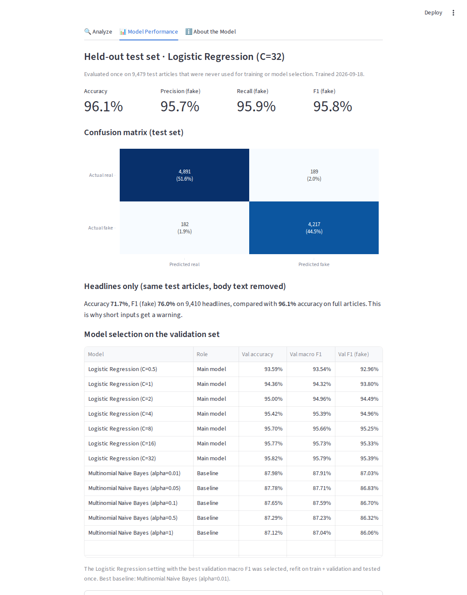

# 📰 NewsLens: Fake News Detection Using Machine Learning

[](https://github.com/<your-username>/NewsLens/actions/workflows/tests.yml)
[](LICENSE)

**🔗 Live demo:** *add your Streamlit URL here after deploying*

NewsLens is a Streamlit web app. You paste an English news headline or article, and a
**TF-IDF + Logistic Regression** model trained on the public **WELFake** dataset
predicts whether it is *Likely real* or *Likely fake*.

> ⚠️ **NewsLens is an educational classifier, not a fact-checking service.** It
> recognises writing patterns learned from labeled training data. It does **not**
> verify facts, browse current news, or prove that an article is true or false.



---

## Contents
1. [Features](#features)
2. [Architecture and data flow](#architecture-and-data-flow)
3. [Dataset](#dataset)
4. [Installation and running locally](#installation-and-running-locally)
5. [Training and evaluation](#training-and-evaluation)
6. [Results](#results)
7. [Limitations and responsible interpretation](#limitations-and-responsible-interpretation)
8. [Deployment (GitHub + Streamlit Community Cloud)](#deployment-github--streamlit-community-cloud)
9. [Troubleshooting](#troubleshooting)
10. [Concepts explained simply](#concepts-explained-simply)
11. [Interview explanation](#interview-explanation)
12. [Future improvements](#future-improvements)
13. [License and attribution](#license-and-attribution)

---

## Features

| Area | What it does |
|---|---|
| **Analyze** | Large text box, **Analyze News** and **Reset** buttons, three clearly labeled illustrative examples, and input validation for empty, too-short, non-English-looking and too-long text. |
| **Prediction card** | *Predicted label: Likely real / Likely fake*, the model's probability **estimate** with a bar chart, and a plain-English guide to reading it. Short inputs get a "less reliable" warning. |
| **Influential terms** | For Logistic Regression, each term's exact contribution (TF-IDF weight × coefficient) is shown as a chart, labeled as *model signals, not evidence*. |
| **Model Performance** | The saved held-out test metrics, confusion matrix, a headlines-only comparison, and the full validation table (Logistic Regression vs. the Naive Bayes baseline). |
| **About the Model** | How it works, the dataset and its license, limitations, and a privacy note. |
| **Reliability** | The model is loaded once (`st.cache_resource`) and never retrained by the app. If the model file is missing, the app shows a clear error. It never switches to random or keyword-based predictions. Pasted text is not stored or logged. |

## Architecture and data flow

```
NewsLens/
├── app.py                     # Streamlit web app (loads the model, never trains)
├── src/
│   ├── config.py              # Paths, labels, dataset info, hyperparameters
│   ├── preprocessing.py       # clean_text (used inside the Pipeline) + de-dup normalisation
│   ├── data.py                # WELFake schema adapter, cleaning, de-duplication, grouped split
│   ├── model.py               # Builds Pipeline: clean -> TF-IDF -> classifier
│   ├── train.py               # Train, select on validation, test once, save artifacts
│   ├── evaluation.py          # Accuracy, precision, recall, F1, confusion matrix
│   ├── inference.py           # Load artifacts, predict, explain terms
│   ├── validation.py          # User-input checks
│   ├── inspect_dataset.py     # Prints dataset facts + label-direction check
│   ├── charts.py              # Plotly charts
│   └── examples.py            # Illustrative (invented) example inputs
├── tests/                     # pytest: validation, preprocessing, inference, app smoke tests
├── data/README.md             # Dataset download, schema, label mapping (CSV itself not committed)
├── models/                    # newslens_pipeline.joblib, metrics.json, metadata.json, README.md
├── docs/screenshots/
├── .streamlit/config.toml
├── .github/workflows/tests.yml
├── requirements.txt / requirements-dev.txt
├── .gitignore
└── LICENSE
```

```
WELFake_Dataset.csv
   │  src/data.py: adapt schema → fill missing → drop empty → remove duplicates → group near-duplicates
   ▼
Grouped split (seed 42): train 70% │ validation 15% │ test 15%
   │  src/train.py
   ├─ fit each candidate on TRAIN, score on VALIDATION → pick best Logistic Regression
   ├─ refit best on TRAIN + VALIDATION
   └─ evaluate ONCE on TEST
   ▼
models/newslens_pipeline.joblib  (clean → TF-IDF → LogisticRegression, all in one object)
models/metrics.json, models/metadata.json
   ▼
app.py → load once (cached) → validate input → pipeline.predict_proba → prediction card
```

Because cleaning and TF-IDF live **inside** the saved scikit-learn `Pipeline`, the app
applies exactly the same preprocessing as training.

## Dataset

**WELFake** by Pawan Kumar Verma, Prateek Agrawal and Radu Prodan.
Zenodo: <https://zenodo.org/records/4561253> · DOI `10.5281/zenodo.4561253` ·
License **CC BY 4.0**. The file is about 245 MB and has 72,134 articles, merged from
Kaggle, McIntire, Reuters and BuzzFeed Political news collections.

| Column | Meaning |
|---|---|
| *(unnamed)* | serial number (ignored) |
| `title` | headline (558 missing) |
| `text` | article body (39 missing) |
| `label` | raw `0` = **real**, raw `1` = **fake** (see note) |

**Label note:** the Zenodo page describes the label as "0 = fake and 1 = real", but the
file behaves the other way round. 60.7% of raw-`0` articles contain a "(Reuters)"
dateline (real Reuters news) versus 0.0% of raw-`1` articles, and the class counts
(37,106 × `1`, 35,028 × `0`) match the page's "37,106 fake / 35,028 real". Run
`python -m src.inspect_dataset` to check it on your own copy. Full details are in
[`data/README.md`](data/README.md).

**Setup:** download `WELFake_Dataset.csv` from the Zenodo page and save it as
`data/WELFake_Dataset.csv`. It is git-ignored and never committed.

## Installation and running locally

Requires **Python 3.12** (3.11 also works). Check with `python --version` (Windows) or
`python3 --version` (macOS/Linux).

### 1. Get the code
```bash
git clone https://github.com/<your-username>/NewsLens.git
cd NewsLens
```
(Or unzip the downloaded project and `cd` into the folder.)

### 2. Create and activate a virtual environment

**Windows (PowerShell)**
```powershell
python -m venv .venv
.venv\Scripts\Activate.ps1
```
If PowerShell blocks the script, run `Set-ExecutionPolicy -Scope CurrentUser RemoteSigned` once, or use Command Prompt: `.venv\Scripts\activate.bat`.

**macOS / Linux**
```bash
python3 -m venv .venv
source .venv/bin/activate
```
Your prompt now starts with `(.venv)`. Use `python` for the rest of the steps.

### 3. Install dependencies
```bash
python -m pip install --upgrade pip
pip install -r requirements-dev.txt
```
(`requirements.txt` holds only what the app needs. `requirements-dev.txt` adds pytest.)

### 4. Prepare the dataset
Download `WELFake_Dataset.csv` from <https://zenodo.org/records/4561253> into `data/`, then:
```bash
python -m src.inspect_dataset
```
The last line should end with `consistent`.

### 5. Train and evaluate
```bash
python -m src.train
```
This takes about **5–10 minutes** on a laptop (cleaning 72k articles plus 12 model fits).
It prints the validation table and the final test metrics, then writes the files in `models/`.

### 6. Run the tests
```bash
pytest -q
```
The tests use a tiny synthetic fixture model and temporary folders. They **do not** need the
dataset or the trained model, and they never overwrite `models/`.

### 7. Run the app
```bash
streamlit run app.py
```
Open <http://localhost:8501>. Stop it with `Ctrl + C`.

## Training and evaluation

**Cleaning and leakage control** (`src/data.py`, `src/preprocessing.py`)
- Missing titles or bodies become empty strings. Headline and body are joined into one document.
- Documents with **fewer than 5 words** after cleaning are dropped.
- `clean_text` removes URLs, emails, @handles and a documented list of **publisher
  markers** ("WASHINGTON (Reuters) -" datelines, "Reuters", "Breitbart", "21st Century Wire",
  "Featured image via…", "Read more", "Follow X on Twitter", tweet-embed fragments).
  Without this the model learns "says Reuters → real", which is a shortcut, not a skill.
- **Exact duplicates** are found after aggressive normalisation (lower-case, no punctuation,
  no URLs or markers) and removed *before* splitting. If duplicates disagree on the label,
  all copies are dropped.
- **Near-duplicates** (same normalised headline with 5+ words, **or** same first 300
  normalised characters of body text) are joined into groups with a union-find. The
  split uses scikit-learn's `GroupShuffleSplit`, so a story and its re-post can never be
  on both sides of a split. `train.py` checks that no group is shared.

**Model selection**
- TF-IDF: unigrams + bigrams, `min_df=3`, `max_df=0.9`, `sublinear_tf=True`, 100k features,
  fitted on the training split only.
- Logistic Regression (main): `C ∈ {0.5, 1, 2, 4, 8, 16, 32}`.
- Multinomial Naive Bayes (baseline): `alpha ∈ {0.01, 0.05, 0.1, 0.5, 1}`.
- Selection metric: **validation macro-F1**. The best Logistic Regression is refit on
  train + validation, then evaluated **once** on the held-out test set.
- A diagnostic re-scores the same test articles using **only their headlines** to measure
  how much reliability drops for short inputs.

## Results

Measured by `python -m src.train` on `WELFake_Dataset.csv` (MD5
`73c9675a4b3d09f86a6933d0b8d7d908`), scikit-learn 1.9.1, seed 42, trained 2026-09-18.
The exact numbers are stored in `models/metrics.json`.

**Data after preparation:** 72,134 rows → 84 empty dropped → **8,733 exact duplicates
removed** → 63,317 articles (34,518 real / 28,799 fake) in 62,264 near-duplicate groups.
Split: 44,330 train / 9,508 validation / 9,479 test.

**Validation (model selection)**

| Model | Val accuracy | Val macro-F1 |
|---|---|---|
| Logistic Regression C=0.5 | 93.59% | 93.54% |
| Logistic Regression C=4 | 95.42% | 95.39% |
| **Logistic Regression C=32 (selected)** | **95.82%** | **95.79%** |
| Multinomial NB alpha=0.01 (best baseline) | 87.98% | 87.91% |
| Multinomial NB alpha=1 | 87.12% | 87.04% |

**Held-out test set: final model, evaluated once (9,479 articles)**

| Metric | Value |
|---|---|
| Accuracy | **96.1%** |
| Precision (fake) | 95.7% |
| Recall (fake) | 95.9% |
| F1 (fake) | 95.8% |
| Macro F1 | 96.1% |

Confusion matrix (rows = actual, columns = predicted):

| | Predicted real | Predicted fake |
|---|---|---|
| **Actual real** | 4,891 | 189 |
| **Actual fake** | 182 | 4,217 |

**Headlines only (same test articles, body removed, 9,410 with a headline):** accuracy
**71.7%**, recall on real articles only 49.8%. The model leans heavily toward "fake" on
short text, which is why the app warns about short inputs.



## Limitations and responsible interpretation

- **Style, not truth.** The model learns vocabulary and writing style. A false claim
  written in a sober, wire-service style can be labeled *real*, and a true but emotional
  post can be labeled *fake*.
- **The probability is an estimate, not a truth score.** "92% fake" means the text is very
  similar to fake-labeled training articles, not that there is a 92% chance it is false.
- **Source labels, not claim labels.** WELFake labels mostly reflect *where* an article came
  from, not a fact-check of each sentence.
- **Publisher and source shortcuts.** Obvious markers are removed, but learned signals still
  include publisher habits: wire-style phrases like "said on Tuesday" point toward *real*,
  while words like "via", "video", "watch" and "featured image" point toward *fake*
  (see `top_terms` in `models/metrics.json`). Some of the 96% accuracy comes from style
  differences between outlets.
- **Time and topic bias.** The data is dominated by US politics around the 2016 election
  ("hillary", "obama", "2016" are strong signals). The model knows nothing about newer
  events, people or topics, and its accuracy on recent news has **not been measured**.
- **Same-distribution evaluation.** The test set comes from the same dataset. Real-world
  accuracy on unfamiliar sources will be lower.
- **Short text is weak** (71.7% on headlines vs 96.1% on full articles). English only.
- **Do not use it** to censor, rank or make decisions about content or people.

## Deployment (GitHub + Streamlit Community Cloud)

### Push to GitHub
1. Sign in to GitHub and create a **new empty repository** called `NewsLens`. Don't add a
   README, .gitignore or license, because the project already has them.
2. In the project folder (with the trained model in `models/`):
   ```bash
   git init -b main
   git add .
   git status          # check: models/*.joblib IS listed, data/*.csv and .venv are NOT
   git commit -m "Initial commit: NewsLens"
   git remote add origin https://github.com/<your-username>/NewsLens.git
   git push -u origin main
   ```
   When asked for a password, use a GitHub **personal access token**, or sign in through
   the browser window that Git opens.
3. Replace `<your-username>` in this README with your GitHub username, then commit and push again.

### Make the trained model available to the deployed app
The fitted pipeline is about **2 MB**, far below GitHub's 100 MB per-file limit, so the
practical approach is to **commit the three files in `models/`** (step 2 already does this).
The deployed app loads them from the repository and never trains.

- Only commit a model **you trained yourself**. `joblib`/pickle files can run code when
  loaded, so never load one from an untrusted source.
- If you retrain, commit the new `newslens_pipeline.joblib`, `metrics.json` and
  `metadata.json` together.
- Keep the scikit-learn version in `requirements.txt` the same as the one used for training.

### Deploy on Streamlit Community Cloud
(Steps checked against the official docs,
[Deploy your app](https://docs.streamlit.io/deploy/streamlit-community-cloud/deploy-your-app/deploy),
in September 2026.)
1. Go to [share.streamlit.io](https://share.streamlit.io) and sign in with GitHub.
2. Click **Create app** (top-right), then **"Yup, I have an app."**
3. Fill in **Repository** `<your-username>/NewsLens`, **Branch** `main`,
   **Main file path** `app.py`, and optionally a custom **App URL**.
4. Open **Advanced settings** and choose **Python 3.12** (the current default). No secrets are needed.
5. Click **Deploy**. Community Cloud installs `requirements.txt` from the repo root. The first
   build takes a few minutes.
6. Paste your app URL into the "Live demo" line at the top of this README.

Community Cloud is offered free at the time of writing, but its terms, limits and
pricing can change. Apps that aren't used for a while may go to sleep and need a click
to wake up.

## Troubleshooting

| Problem | Fix |
|---|---|
| App says **"The trained model is missing"** | Run `python -m src.train`, or on Streamlit Cloud check that `models/newslens_pipeline.joblib` and `models/metadata.json` are committed (`git ls-files models`). |
| `Dataset not found at .../data/WELFake_Dataset.csv` | Download the CSV into `data/`. Rename `WELFake_Dataset (1).csv` if your browser added a number. |
| `missing required column(s)` | You have a different file. Use the Zenodo CSV (columns `title`, `text`, `label`). |
| `ModuleNotFoundError: No module named 'src'` | Run commands from the **project root** and use `python -m src.train`, not `python src/train.py`. |
| `ModuleNotFoundError` for streamlit/sklearn | Activate the virtual environment, then `pip install -r requirements-dev.txt`. |
| Warning *"trained with scikit-learn X but Y is installed"* or errors while loading the model | Reinstall the pinned versions (`pip install -r requirements.txt`) or retrain and commit new artifacts. |
| `.venv\Scripts\Activate.ps1 cannot be loaded` (Windows) | `Set-ExecutionPolicy -Scope CurrentUser RemoteSigned`, or use `activate.bat` in Command Prompt. |
| `python` not found (macOS/Linux) | Use `python3`. |
| Streamlit Cloud build fails | Open **Manage app → logs**. Check that `requirements.txt` is in the repo root and that you selected Python 3.12. |
| `git push` rejected / authentication failed | Use a personal access token, not your password. Check the remote with `git remote -v`. |
| Training runs out of memory | Lower `max_features` in `src/config.py` (for example to 50,000) and retrain. |

## Concepts explained simply

**TF-IDF (Term Frequency × Inverse Document Frequency).** It turns text into numbers.
Each word or two-word phrase gets a score that is high when it appears **often in this
article** but **rarely across all articles**. "the" gets a low score because it is
everywhere. "chemtrails" gets a high score because it is rare and specific. Each article
becomes a long vector of these scores.

**Logistic Regression for text.** The model learns one weight per term. Positive weights
push toward *fake*, negative weights toward *real*. For a new article it multiplies each
TF-IDF score by the term's weight, adds everything up (plus a bias), and squashes the sum
into 0–1 with the sigmoid function. Above 0.5 → *Likely fake*. Because it is a simple sum,
you can see exactly which terms pushed the decision, and that is what the "influential terms"
chart shows.

**Why train / validation / test.** *Train* is what the model learns from. *Validation* is
used to choose settings (like `C`) and to compare against Naive Bayes. *Test* is locked away
and used **once** at the end. If you pick settings by looking at the test score, the test
score stops being an honest estimate. Duplicates are grouped so the model is never "tested"
on an article it has already seen.

**Precision, recall, F1** (for the *fake* class):
- **Precision:** of the articles the model called fake, how many really were fake?
  (Low precision means real news gets wrongly flagged.)
- **Recall:** of all the truly fake articles, how many did the model catch?
  (Low recall means fake news slips through.)
- **F1:** the harmonic mean of the two. It is high only when both are high.

**Why 96% accuracy doesn't mean reliable fact-checking.** The test articles come from the
same outlets, era and topics as the training articles, so the model can use outlet style
and 2016-era vocabulary as clues. Real-world news is written by different outlets about new
events. The model never checks facts, so a well-written false story can fool it. High
accuracy on one dataset measures pattern matching on that dataset, not truth detection.

## Interview explanation

> "NewsLens is a fake-news text classifier with a Streamlit front end. I trained it on the
> public WELFake dataset of about 72,000 labeled articles. The pipeline cleans the text, removing
> URLs and publisher markers like 'Reuters' datelines so the model can't cheat. It then turns the
> text into TF-IDF features with unigrams and bigrams and classifies it with Logistic Regression.
> Multinomial Naive Bayes is my baseline.
>
> I paid attention to leakage. I removed about 8,700 duplicates before splitting and grouped
> near-duplicates so a story and its copy can't end up in both train and test. I also used a
> separate validation set for choosing the regularisation strength and touched the test set
> only once. The final model got 96.1% accuracy and 95.8% F1 on 9,479 held-out articles,
> versus about 88% for Naive Bayes.
>
> The main limitation is that it learns style, not truth. On headlines alone accuracy drops
> to about 72%, the data is mostly 2016 US politics, and some signals are outlet habits.
> So I present it as an educational classifier with clear warnings, not a fact-checker. With
> more time I'd test it on a dataset from different sources and years and try a transformer
> model."

## Future improvements
- Evaluate on a **different** dataset (other sources and years) to measure real generalisation.
- Split by publisher or date, not just by near-duplicate group.
- Probability calibration (`CalibratedClassifierCV`) and a reliability diagram.
- A fine-tuned transformer model (such as DistilBERT) as a comparison.
- A separate headline-only model trained on titles.
- Multilingual support and batch CSV analysis.

## License and attribution
- **Code:** MIT License. See [LICENSE](LICENSE).
- **Dataset:** WELFake by Pawan Kumar Verma, Prateek Agrawal and Radu Prodan,
  <https://zenodo.org/records/4561253>, licensed **CC BY 4.0**. The dataset is not included
  in this repository. The trained model in `models/` is derived from it. Please cite:
  Verma, P. K., Agrawal, P., & Prodan, R. (2021). *WELFake: Word Embedding Over Linguistic
  Features for Fake News Detection.* IEEE Transactions on Computational Social Systems.
  doi:10.1109/TCSS.2021.3068519.
